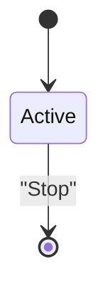

# 🚀 Release Notes - v0.2.0

We are excited to announce **Settings Manager v0.2.0**! This release introduces powerful Mermaid integration, allowing you to define state machines directly in your Markdown configuration files and use them as executable objects in Python.

## ✨ Highlights

- **🧜‍♂️ Mermaid Integration**: Effortlessly parse Mermaid state diagrams.
- **🏃‍♂️ Executable States & Transitions**: States are automatically converted to callable functions, and transitions are managed objects.
- **🛡️ Cerberus Support**: New `mermaid_diagram` type for robust validation of your diagrams.
- **🔌 Zero Dependencies for Mermaid**: We've implemented a custom parser, removing the need for `pyStateGram` and keeping the library lightweight.
- **📚 Improved OSS Compliance**: Better documentation and refined project structure.

## 📦 Installation

Update your installation:

```bash
pip install --upgrade settings-manager
```

## 🧜‍♂️ Quick Mermaid Example

Add to your `.md` file:



Access in Python:

```python
diagram = settings['mermaid']['diagram']
diagram.states['Active']()
```

---
*Happy Configuring!*
